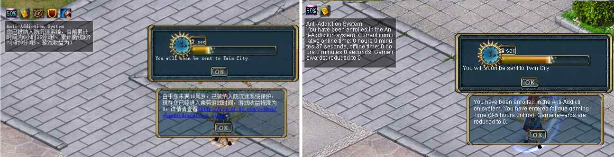

# Enthrallment (China Anti-Addiction System)

> ⚠️ __WARNING__
>
> The document is written by observing client patch 5517. There may be significant differences between client patches.
>
> This feature exists in the client binary but is fully gated by a region check. This feature cannot be used unless the client is patched. It is documented for informational purposes.

Enthrallment is the client-side implementation of China's Anti-Addiction regulation, introduced circa 2007. Players in China were required to link their account with their personal ID card. Under-18s had strict online time thresholds which, when reached, progressively restrict game rewards and actions.

This entire system is gated on the client locale, which is found in a hardcoded value in `GraphicData.dll`. On Chinese clients this value returns `中文` (Chinese). On all other locales (e.g. `English`) the check fails and the system is **entirely inactive**; all messages related to Enthrallment are skipped.

The server tracks how long a player has been online and offline in a day (midnight to midnight). The server sends Enthrallment updates to the client via [MsgUserAttrib](../network/messages/msguserattrib.md).

## States and Thresholds

From archived official documentation and reverse engineering the binary, the thresholds and states a player under 18 would reach are:

| Hours Online | State     | XP-Gain | Item Drop Rate | Reminder                                  | Other                                                                                                                              |
|:-------------|:----------|:--------|:---------------|:------------------------------------------|:-----------------------------------------------------------------------------------------------------------------------------------|
| 0-3 hours    | Healthy   | Normal  | Normal         | System Message (String: #11070) every 1hr | Game plays as without restrictions                                                                                                 |
| 3-5 hours    | Fatigue   | Halved  | Halved         | Popup (String: #11060) every 30min        | Client blocks all item and action operations (equip, use, sell, buy, pick up, trade, attack) with a 'Operation Failed' System Message |
| > 5 hours    | Unhealthy | None    | None           | Popup (String: #11061) every 15min        | Client blocks all item and action operations (equip, use, sell, buy, pick up, trade, attack) with a 'Operation Failed' System Message |

### Translated Strings

The Chinese strings related to Enthrallment can be found in [StrRes.ini](../files/content/StrRes.ini.md). Using Google Translate, these strings translate to:

#### String 11060 (3-5 hours, Fatigue)
> "Because you are under 18, you have been placed under the Anti-Addiction system. You have now entered fatigue game time and your game rewards will be reduced to 0. Please see details [link_redacted]."

#### String 11061 (> 5 hours, Unhealthy)
> "Because you are under 18, you have been placed under the Anti-Addiction system. You have now entered unhealthy game time and your game rewards will be reduced to 0. Please see details [link_redacted]."

#### String 11066 (Status Icon Tooltip Template)
> "You have been enrolled in the Anti-Addiction system. Current cumulative online time: %d hours %d minutes %d seconds, offline time: %d hours %d minutes %d seconds. Game rewards: %s"

#### String 11067 (State Label: Healthy)
> "Normal"

#### String 11068 (State Label: Unhealthy)
> "reduced to 0"

#### String 11069 (State Label: Fatigue)
> "reduced to 0"

#### String 11070 (System Message Summary)
> "You have been enrolled in the Anti-Addiction system. After 3 cumulative hours online, game rewards will be 0 and you may only chat and walk. Current cumulative online time: %d hours %d minutes %d seconds, cumulative offline time: %d hours %d minutes %d seconds."

## Message Flow

> ⚠️ __WARNING__
>
> The flow of the messages is inferred

On player login, the server sends two [MsgUserAttrib](../network/messages/msguserattrib.md) packets: [MsgUserAttrib: USERATTRIB_ENTHRALLMENT_ONLINE_TIME_SYNC](../network/messages/msguserattrib.md) to set `CHero::SetOnLineTime(Data1)` and [MsgUserAttrib: USERATTRIB_ENTHRALLMENT_OFFLINE_TIME_SYNC](../network/messages/msguserattrib.md) to set `CHero::SetOffLineTime(Data1)`, where `Data1` is the player's accumulated online/offline time in seconds since midnight. [MsgUserAttrib: USERATTRIB_ENTHRALLMENT_ONLINE_TIME_SYNC](../network/messages/msguserattrib.md) also sets `CHero::SetEnthrallment(true)` and records the synchronization time in `CHero::SetLastSynchronizeTime(TimeGet())`. Once both values are received, the [System Message Summary](#string-11070-system-message-summary) and a Status Icon are shown.

The client starts its own timer for the Status Icon, but the server sends [MsgUserAttrib: USERATTRIB_ENTHRALLMENT_ONLINE_TIME_SYNC](../network/messages/msguserattrib.md) periodically and when `Data1` equals 3600 (1hr), 7200 (2hr) or 10800 (3hr) it triggers the [System Message Summary](#string-11070-system-message-summary) to display again as a reminder.

When the player reaches **three hours** of accumulated online time, the server sends [MsgUserAttrib: USERATTRIB_ENTHRALLMENT_UPDATE_STATE](../network/messages/msguserattrib.md) with `Data1` set to `50`. This sets `CHero::SetEnthrallmentState(50)`. It also displays two dialogs - one to tell the user they are in the `Fatigue` state and another dialog with a countdown to teleport the player to Twin City.



When the player reaches **five hours** of accumulated online time, the server sends [MsgUserAttrib: USERATTRIB_ENTHRALLMENT_UPDATE_STATE](../network/messages/msguserattrib.md) with `Data1` set to `0`. This sets `CHero::SetEnthrallmentState(0)`. It also displays a single dialog - informing the user they are in an `Unhealthy` state.

At midnight, the server sends [MsgUserAttrib: USERATTRIB_ENTHRALLMENT_RESET](../network/messages/msguserattrib.md) which clears both the online and offline accumulated time and sets `CHero::SetEnthrallmentState(100)` (Healthy).

## Patching Script

To enable Enthrallment on a non-Chinese client, patch `GraphicData.dll` to replace the hardcoded locale string `English` with the GBK encoding of `中文` (`\xD6\xD0\xCE\xC4`), null-padded to the original length.

You should back up the original `GraphicData.dll`.

```python
import sys

with open(sys.argv[1], "rb") as f:
    data = f.read()

idx = data.find(b"English")
if idx == -1:
    print("ERROR: 'English' not found already patched or wrong file?")
    sys.exit(1)

patched = data[:idx] + b"\xD6\xD0\xCE\xC4\x00\x00\x00" + data[idx + len(b"English"):] # 中文 + padding

with open(sys.argv[1], "wb") as f:
    f.write(patched)

print(f"Patched at offset 0x{idx:x}")
```

Usage: `python patch_graphicdata.py GraphicData.dll`

## Other Chinese-Gated Features

The following features share the same `中文` locale gate:

**PK Map Entry Notification:** When `MsgMapInfo` arrives with `PKType` as `1` or `2`, a system chat message is shown to say whether PK is allowed on the map or not.
